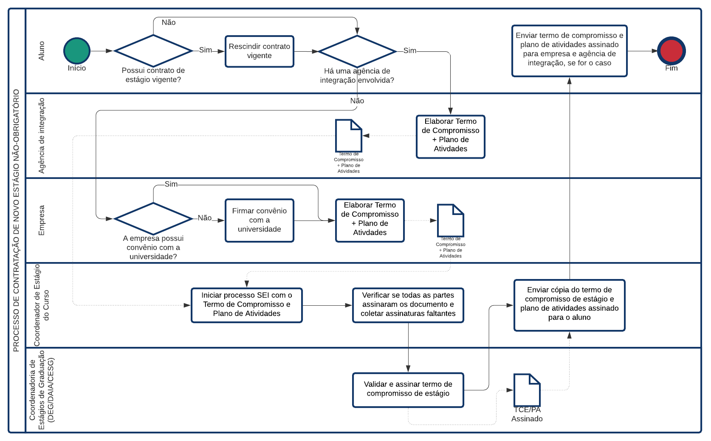

## Inscrição para a disciplina de Estágio Supervisionado

Basta acessar [este formulário](https://forms.office.com/r/wPwuFSj8ca).

Você vai precisar de um orientador de estágio, e a matrícula dele(a), além da documentação comprobatória, histórico escolar e grade horária, os dois últimos emitidos pelo SIGAA.

Leia abaixo um pouco mais sobre a disciplina de [estágio supervisionado](#estágio-supervisionado).

* [Sobre o estágio](#sobre-o-estágio)

* [Estágio supervisionado](#estágio-supervisionado)

* [Estágio não-obrigatório](#estágio-não-obrigatório)

## Sobre o estágio

#### Quais são as diretrizes de estágio?

Há três diretrizes importantes de estágios que devemos observar:

1. [Lei 11.788 de 25 de setembro de 2008](http://www.planalto.gov.br/ccivil_03/_ato2007-2010/2008/lei/l11788.htm)

2. [Diretrizes de Estágio da UnB](http://www.deg.unb.br/images/Diretorias/DAIA/cesg/arquivos_gerais/Diretrizes_de_Est%C3%A1gio_da_UnB_1.pdf)

3. [Regulamento de Estágio da FGA](regulamento_estagio_fga.pdf)

#### Quais são as modalidades de estágio?

Há apenas duas modalidades de estágio: **obrigatório** e **não-obrigatório**.

*Estágio obrigatório* é o estágio que o aluno faz para cumprir os requisitos para a disciplina de *Estágio Supervisionado*. Nesta modalidade, pagamento de bolsa é opcional.

*Estágio não-obrigatório* é uma atividade opcional que pode ser desenvolvida por qualquer aluno de graduação a qualquer momento do curso.

**Importante**: As duas modalidades de estágio são supervisionadas, ou seja, requerem um orientador de estágio e a apresentação de um relatório de atividades a cada 6 meses, no máximo, durante a vigência do estágio.

## Estágio supervisionado

Estágio supervisionado é uma disciplina dos cursos de Engenharia da FGA.

#### Quando faço a matrícula para a disciplina de estágio supervisionado?

A matrícula **não** é feita junto com a matrícula das demais disciplinas. **No semestre 2021/1, a matrícula ocorrerá de 26/07/2021 a 27/08/2021**. A solicitação de matrícula será feita pelo Microsoft Forms. O link para preenchimento do formulário será publicado nesta página e pela lista de e-mails da FGA (eng_software@listas.fga.unb.br).

#### Como funciona a matrícula em Estágio Supervisionado?

Depois que o aluno solicita sua matrícula, o coordenador de estágio do curso, bem como a coordenação do curso, avaliam se o aluno cumpre todos os requisitos para cursar a disciplina. Depois de avaliados os requisitos, a secretaria da coordenação de cursos faz a matrícula de todos os alunos cuja solitação foi deferida.

#### Quais os requisitos para cursar estágio supervisionado?

O aluno deve:
* ter concluído 70% da carga horária total do curso

* apresentar 210h de atividades técnicas supervisionadas até a conclusão da disciplina

* não exceder o limite de 32 créditos no total em disciplinas matriculadas (a não ser que seja um provável formando)
	- a disciplina de estágio supervisionado possui 14 créditos, portanto o limite máximo de créditos em outras disciplinas é 18 (veja item a seguir).
	- o Art. 6 do [regulamento de estágios da FGA](regulamento_estagio_fga.pdf) rege que alunos que estejam fazendo 30h semanais em estágio (obrigatório ou não-obrigatório) podem cursar, no máximo, 8 créditos em disciplinas.
	- essa regra não se aplica a prováveis formandos, ou seja, àqueles que terminarão o curso até o final do semestre.

#### Quais atividades são aceitas para a disciplina de estágio supervisionado?

1. Estágio obrigatório e não-obrigatório em qualquer instituição

2. MEI com contrato de trabalho, contrato de serviço temporário ou trabalho com carteira assinada

3. Projeto de pesquisa com plano de atividades
	
#### Que documentos devo apresentar para realizar a matrícula?

Você precisa apresentar:
* Histórico escolar (emitido pelo SIGAA)
* Grade horária (emitido pelo SIGAA)
* Comprovante da atividade para o estágio, que pode ser:

1. Estágio obrigatório e não-obrigatório em qualquer instituição
	- apresentar o *termo de compromisso de estágio* e o *plano de Atividades* assinados pelo Coordenador de Estágios da FGA e pela [CESG](http://www.deg.unb.br/a-coordenacao).

2. MEI com contrato de trabalho, contrato de serviço temporário ou trabalho com carteira assinada
	- apresentar *contrato de trabalho* ou qualquer documento que demonstre vínculo com a instituição, data do vínculo e carga horária de trabalho.

3. Projeto de pesquisa com plano de atividades
	- apresentar *plano de atividades* com assinatura do coordenador do projeto, constando período de vigência, carga horária e nome do grupo/instituição de pesquisa.

Além dos documentos, você precisa de um orientador de estágio. Pode ser qualquer professor da UnB que concorde em orientá-lo.

#### Como escolher um orientador de estágio para a disciplina de estágio supervisionado?

O Orientador de Estágio para a disciplina de Estágio Supervisionado poderá qualquer professor da FGA (ou mesmo da UnB) que esteja disponível para fazer a avaliação do relatório de estágio.

Uma lista de sugestões de candidatos para Orientador de Estágio é a seguinte:
1. professor(a) orientador(a) de TCC;
2. professor(a) orientador(a) de projeto de pesquisa;
3. professor(a) orientador(a) de iniciação científica;
4. Coordenador(a) de Estágio do curso;
5. Coordenador de Graduação do curso.

#### O orientador de estágio precisa ser o mesmo que consta no termo de compromisso de estágio?

Não.

#### Eu preciso fazer as atividades de estágio supervisionado no decorrer da disciplina?

Não. Entretanto, você poderá aproveitar retroativamente apenas as atividades que você fez depois de completar 70% do curso.

#### Se eu aproveitar atividades retroativamente, a restrição do limite de créditos se aplica a mim?

Sim. Independentemente da forma como você apresentará suas atividades na disciplina, a disciplina possui 14 créditos que são cursados no semestre de matrícula.

#### Como é feita a avaliação na disciplina de estágio supervisionado?

1. Formulário de avaliação de desempenho do estagiário pela concedente ([Anexo 2](anexos/anexo2.docx)), feito e assinado pelo supervisor de estágio na empresa

2. Formulário de avaliação da concedente pelo estagiário ([Anexo 4](anexos/anexo4.docx)), feito e assinado pelo aluno

3. Relatório de estágio ([Anexo 5](anexos/anexo5.pdf))

O professor orientador do estágio dará a menção final ao aluno com base no Anexo 2 e Anexo 5.

#### Sou CLT, PJ ou tenho um contrato de trabalho. Devo apresentar o formulário de avaliação de desempenho do estagiário pela concedente (Anexo 2)?

Sim. Esse é o pulo do gato: se você é CLT, PJ ou coisa do tipo, precisa ter alguém na sua empresa que vai fazer as vezes de "supervisor de estágio" e te avaliará usando o Anexo 2.

#### Estou aproveitando um estágio/trabalho retroativamente e não tenho mais contato com a empresa. Como fazer?

Infelizmente, para ser avaliado, você precisa entregar o Anexo 2, que é o formulário de avaliação do estagiário pela concedente. Portanto, você precisa ter alguém que trabalhe na concedente e que ateste sua avaliação. Então, leve isso em consideração ao escolher alguma atividade para aproveitar retroativamente: se você não tem mais contato com ninguém da empresa, você não vai conseguir entregar tudo que precisa para ser avaliado na disciplina.

#### Contratos de trabalho (CLT, MEI ou temporário) precisam ser formalizados junto à CESG?

Não.

## Estágio não obrigatório

#### Quem pode fazer estágio não-obrigatório?

Qualquer aluno regularmente matriculado.

#### Há alguma restrição para a realização do estágio?

Sim. O Art. 6 do [Regulamento de Estágio da FGA](regulamento_estagio_fga.pdf) diz que estágios com carga horária semanal de 30h só podem ser feitos durante as férias ou por alunos que cursem, no máximo, 8 créditos em disciplinas durante o semestre letivo. No momento atual, a coordenação de cursos da FGA está abrindo exceção a este artigo, mas ele pode voltar a vigorar a qualquer momento.

#### Encontrei um estágio. E agora?

Você deve formalizar seu estágio junto à UnB, senão seu contrato não é válido.

Para formalização, você precisa providenciar um *termo de compromisso de estágio* e um *plano de atividades* e apresentá-los ao coordenador de estágio do seu curso.

Veja o processo detalhado (clique para ampliar): 

#### Eu posso fazer estágio em qualquer empresa?

Sim. Entretanto, o responsável pelo termo de compromisso precisa ser conveniado à UnB. Isto significa o seguinte:
* Se houver uma agência integração envolvida, a agência precisa ter convênio com a UnB, mas a empresa não necessariamente.

* Se não houver uma agência de integração envolvida, a empresa precisa ter convênio com a UnB.

#### Como minha empresa pode conveniar-se à UnB?

A empresa deve entrar em contato com a UnB pelo e-mail convenioestagio@unb.br.

#### Posso ir preparando meu termo de compromisso enquanto a empresa firma convênio com a UnB?

Sim, mas a data de início do estágio deverá ser posterior à data de celebração do convênio entre a UnB e a empresa.

<!-- #### Quais são os documentos envolvidos num processo de estágio não-obrigatório?

São 4 possíveis documentos:

* *Termo de compromisso de estágio*: é o documento que deve ser elaborado na fase de contratação. Só tem validade se acompanhado do *plano de atividades*.

* *Termo aditivo de estágio*: é o documento usado para fazer qualquer alteração num termo de compromisso de estágio não-obrigatório vigente (por exemplo, prorrogação da vigência, alteração da carga horária, alteração do supervisor de estágio). Só tem validade se acompanhado do *plano de atividades*.

* *Termo de rescisão de estágio*: é o documento que encerra o estágio antes do final estabelecido no termo de compromisso. Sempre que o estágio terminar antes do tempo estabelecido, este documento deve ser elaborado.

* *Relatório de atividades de estágio*: é um relato das atividades desempenhadas num período, elaborado em conjunto com o supervisor de estágio na empresa e o orientador de estágio na UnB. -->

#### Auxílio transporte e seguro contra acidentes pessoais são obrigatórios para estágios não-obrigatórios?

Sim. Mesmo com a pandemia, ambos são obrigatórios (veja Art. 9 e Art. 12 da [Lei 11.788](http://www.planalto.gov.br/ccivil_03/_ato2007-2010/2008/lei/l11788.htm)).

#### Há algum modelo para os documentos?

Sim.

* [Termo de compromisso de estágio e plano de atividades](modelos/tce_pa.odt)

* [Termo aditivo de estágio e plano de atividades](modelos/aditivo_tce_pa.odt)

* [Plano de atividades](modelos/pa.odt)

* [Termo de rescisão de estágio](modelos/rescisao.odt)

* [Relatório de atividades](modelos/relatorio.odt)

#### Quem precisa assinar o termo de compromisso de estágio e o plano de atividades?

O termo de compromisso de estágio precisa ser assinado:
1. pelo aluno, 
2. pelo(a) representante da empresa e
3. pela UnB.

O plano de atividades, por sua vez, deve ser assinado:
1.  pelo aluno, 
2. pelo supervisor de estágio na empresa, 
3. pelo representante da empresa, 
4. pelo orientador de estágio na UnB e
5. pela UnB.

#### Quem precisa assinar o termo aditivo de estágio?

Os mesmos que assinam o termo de compromisso.

#### Quem precisa assinar o termo de rescisão de estágio?

O termo de rescisão de estágio precisa ser assinado:
1. pelo aluno,
2. pelo representante da empresa e
3. pela UnB.

#### Quem precisa assinar o relatório de atividades?

O relatório de atividades precisa ser assinado:
1. pelo aluno,
2. pelo supervisor de estágio na empresa,
3. pelo orientador de estágio na UnB e
4. pela UnB.

#### Quando devo entregar um relatório de atividades?

No máximo a cada 6 meses durante a vigência do estágio (veja Art. 7 da [Lei 11.788 de estágios](http://www.planalto.gov.br/ccivil_03/_ato2007-2010/2008/lei/l11788.htm)). O relatório deve ser entregue ao coordenador de estágio.

#### Estou utilizando meu estágio não-obrigatório na disciplina de Estágio Supervisionado. Preciso apresentar um relatório de atividades para o estágio não-obrigatório?

Sim. O relatório apresentado na disciplina de Estágio Supervisionado é uma exigência interna do PPC dos cursos de Engenharia da Faculdade do Gama, enquanto que o relatório de atividades do estágio não-obrigatório é uma exigência legal (veja questão anterior). Caso o período do relatório do Estágio Supervisionado seja o mesmo do período não superior a 6 meses do estágio não-obrigatório, o relatório apresentado na disciplina também pode ser apresentado para o estágio não-obrigatório.

#### Quando preciso apresentar um termo aditivo?

Sempre que houver qualquer mudança ao longo do estágio (supervisor, carga horária, vigência) ou quando houver prorrogação.

#### Quando preciso apresentar um termo de rescisão?

Sempre que o estágio for interrompido antes da data final constante no termo de compromisso / termo aditivo.

#### Quem assina os documentos pela UnB?

É a [Coordenadoria de Estágios de Graduação (CESG)](http://www.deg.unb.br/a-coordenacao) da [Diretoria de Acompanhamento e Integração Acadêmica (DAIA)](http://www.deg.unb.br/a-diretoria) do [Decanato de Ensino de Graduação (DEG)](http://www.deg.unb.br/) da UnB.

#### Quanto tempo a CESG demora para assinar um documento?

A CESG assina documentos de estágio de toda a universidade, portanto a demanda é altíssima. Em geral, a demora é de, pelo menos, dois dias úteis, mas dependendo da demanda, pode demorar um pouco mais.

#### Como assinar os documentos?

As partes externas da UnB podem assinar os documentos de três maneiras:

1. **Manualmente**. Neste caso, recomenda-se o uso do carimbo e pede-se cuidado para digitalizar o documento com boa qualidade.

2. **Digitalmente**, usando algum software de assinatura digital, como Adobe Reader, DocuSign, Assine Bem, ClickSign, entre outros. Particularmente, acho interessante a [plataforma de assinatura digital](https://www.gov.br/governodigital/pt-br/assinatura-eletronica) do Gov.br, grauita para qualquer cidadão brasileiro.

3. **Digitalmente, usando o [SEI da UnB](https://www.portalsei.unb.br/)**. O SEI é um sistema institucional, e indicado para as assinaturas. Entretanto, exige cadastro de usuário externo, pessoal e intransferível.

As partes da UnB (orientador de estágio e CESG) assinam pelo SEI da UnB.

#### É possível enviar documentos para assinatura da CESG sem que esteja assinado pelas outras partes?

Não, apenas quando todas as partes envolvidas já tiverem feito a assinatura. O processo é feito assim pois a CESG realiza a validação administrativa dos documentos, e registra o estágio no banco de dados da universidade.

#### É necessário ter um orientador de estágio na UnB para estágio não-obrigatório?

Sim, todo estágio é supervisionado e requer o acompanhamento de um professor da instituição na posição de orientador.

#### Quem pode ser meu orientador de estágio?

Qualquer professor da UnB.

#### Posso solicitar aproveitamento do meu estágio não-obrigatório em créditos?

Sim. Você pode:
1. Aproveitar como atividades complementares, caso tenha feito o estágio (ou parte dele) antes de integralizar 50% do curso. A solicitação deve ser encaminhada à secretaria da FGA (unbgama@unb.br).
2. Aproveitar para o [Estágio Supervisionado](#estágio-supervisionado) caso tenha feito o estágio (ou parte dele) depois de integralizar pelo menos 70% da carga horária do curso.